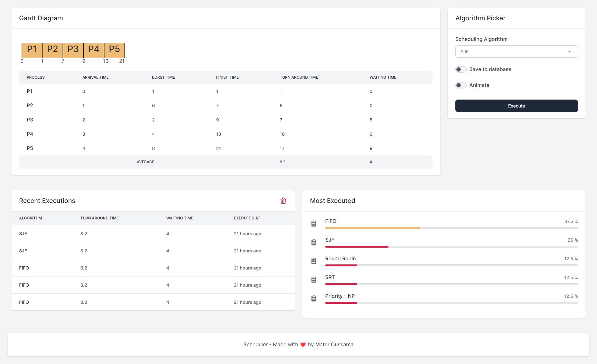

# Process Scheduling Solver
> A Web/CLI tool to generate Gantt Chart and calculate TAT (turnaround time) and WAT (waiting time) based on various scheduling algorithms.

## Supported algorithms
- First Come First Serve / FCFS
- Shortest Job First / SJF (non-preemptive)
- Shortest Remaining Time First / SRTF (preemptive)
- Round-Robin / RR
- Priority (non-preemptive)

## Built with
- C Programming Language
- Laravel
- Livewire